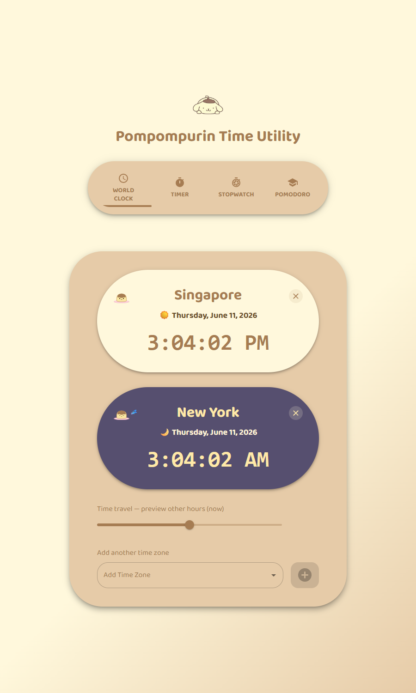

# Pompompurin Time Utility ⏰🍮

A cute, multi-functional time utility app themed after Sanrio's Pompompurin! Built with React, Vite, and Material-UI.



## Features
- **World Clock:** Live times in multiple time zones with day/night themed cards — Pompompurin sleeps on night-time cards! A **smart zone picker** lets you search by city, country, or even abbreviation ("india", "uk", "vietnam") and shows each zone's current UTC offset and local time, grouped by region. Use the **time-travel slider** to preview other hours and see which friends are in friendly calling hours (8am–10pm, green border). A **"best time to reach everyone" overlap strip** shows, hour-by-hour, when all your zones are awake at once — tap any slot to jump there. Your list is saved between visits, and you can **share it as a link** (see below).
- **Living Pudding Timer:** A versatile multi-mode countdown app — choose between **Quick Timer**, **Presentation Segments** (multi-speaker student presentations with segment chimes and "Next Speaker ⏩" manual advance), or **Classroom Exam Mode** (oversized typography, target end-time clock e.g. *"Ends at 11:30 AM"*, 15m/5m warning phases, and fullscreen projection toggle ⛶). Includes **one-tap presets** (Tea, Coffee, Egg, Nap, Focus, 30m 5-student group, 13m pair), natural-language quick set ("25m", "1h30m"), desktop notifications, and state persistence across page refreshes.
- **Stopwatch:** Start, stop, lap, and reset, with a **jiggling pudding mascot** that runs alongside you. Laps show both the lap split and the cumulative total.
- **Pudding Pomodoro:** Focus/break cycles (default 25/5). Every completed focus session earns a pudding sticker and a sprinkle burst — every 4th is golden, and new **flavors (strawberry, matcha, chocolate)** unlock as your sticker sheet grows. A **"Take a breath 🫧" guide** runs a calming box-breathing animation between sessions. Stickers are saved forever, and a running session survives a refresh.
- **World Calendar & 万年历:** A navigable month calendar where each day shows both the Western date and the Chinese lunar date (农历). Tap the month/year title to jump straight to any year (e.g. a birth year like 1988) instead of stepping month by month. Tap any day for its perpetual-calendar (万年历) detail — lunar date, 干支 year and zodiac (生肖), the 24 solar terms (节气: 立春, 春分, 夏至, 冬至…), traditional festivals (春节, 端午, 中秋…) plus common holidays, **tonight's moon phase with a countdown to the next full moon (满月)**, and a playful **daily fortune (宜/忌)** — all bilingual 中英. A "viewing zone" selector (shared with the World Clock list) shifts which day is "today" so you can see the date-line rollover around the world. Powered entirely by the browser's built-in `Intl` calendar plus an astronomical solar-term formula — no extra libraries.
- **Pudding Time Capsules (时光胶囊):** Write a note to your future self — or a friend — and seal it inside a pudding that **cannot be opened until the moment you pick**. Choose any date and time, or use the lunar quick-picks: the **next full moon 🌕, 春节, 中秋节,** or New Year. Sealed capsules sit on your shelf (saved between visits) with real-time 1-second countdown updates; when the moment arrives you get a notification and the pudding wakes up and wobbles — tap it for a sprinkle-burst reveal. You can **re-copy share links directly from any shelf card** or **save received capsules (locked or unlocked)** onto your shelf. Sealing copies a **share link carrying the sealed message itself** (no server involved): the recipient sees only a sealed pudding and opening date until it's time. See "Sharing a capsule" below for how the seal works.
- **Pudding Cursor Chase:** On mouse devices Pompompurin chases your cursor around the page trying to catch his favorite snack! He trails behind with a happy wiggle, faces the way he's running, and dozes off with a 💤 when your mouse rests. Toggle the chase with the 🐾 button in the header (your choice is remembered); it politely stays away on touch screens and for reduced-motion users.
- **Day & Night Mode:** Toggle between the creamy daytime palette and a cozy "bedtime pudding" night theme. Your choice is remembered, and it defaults to your system preference.
- **Installable PWA:** Add it to your phone home screen or desktop — works offline.
- **Pompompurin Theme:** Creamy yellow, brown, and pink color palette, playful font, a Pompompurin mascot in the header, and a **greeting that changes with your local time of day**. The pudding dresses for the occasion — a **party hat on festivals, a flower in spring, shades in summer, a scarf in winter** — and gives you a warm **"welcome back" when you return** after stepping away.
- **Presenter Remote Control (📱):** Launch the app on Laptop A (projector display) and tap the Presenter Remote icon to generate a 6-character case-sensitive PIN and QR code. Scan the QR code with your smartphone camera (or open the link on Laptop B) to remotely switch tabs, start/pause/reset countdowns, advance presentation speakers (`Next Speaker 🎤`), configure speaker counts & durations, and view a **live remaining time & active speaker banner** on your phone screen. Features automatic smooth-scrolling on Laptop A when tabs switch, auto-closing pairing modal upon connection, and one-tap presenter revocation (`🚫 Revoke & Disconnect All Devices`). Powered by WebRTC (PeerJS) — 100% serverless, zero installation, and works across different Wi-Fi networks.
- **Responsive:** Works on desktop and mobile.

## Presenter Remote Control (📱)
The app includes a zero-server presenter remote system using PeerJS WebRTC:

- **Launch Presenter Mode:** On Laptop A (connected to the classroom projector), click the **Presenter Remote** icon in the header bar.
- **Connect Phone / Laptop B:** Scan the QR code using your phone camera or open the link on Laptop B (`…/?mode=controller&pin=XXXXXX`). Pairing modal auto-closes on Laptop A as soon as your device connects!
- **6-Character Case-Sensitive PINs:** Generates high-entropy case-sensitive PIN codes (`e.g. UjVcw3`) to guarantee secure room isolation and prevent unauthorized pairing.
- **Live Two-Way Sync:** Your phone screen displays a live readout of remaining timer seconds (`⏱️ 03:45 remaining`), active speaker badge (`🎙️ Speaker 2 of 5`), and active tab name. Tapping remote buttons (Start, Pause, Reset, Next Speaker 🎤, +1m, +5m, or Tab buttons) immediately updates Laptop A.
- **Presentation Segments Control:** Remotely advance speakers (`Next Speaker 🎤`), adjust total speaker count, set per-speaker minutes, and toggle timer modes (`Quick`, `Presentation`, `Exam`).
- **Auto-Scroll Display:** Laptop A automatically smooth-scrolls to center the active rectangular tab card on the projector display whenever you switch tabs remotely.
- **Security & Revocation:** One-tap **"🚫 Revoke & Disconnect All Devices"** button on Laptop A immediately terminates active remote sessions.
- **GitHub Pages Ready:** Communication is direct Peer-to-Peer — no backend server or hosting setup required.


## Sharing your clock
The World Clock list is encoded in the page URL, so it travels with the link:

- The address bar always reflects your current zones, e.g.
  `…/pompompurin-time-utility/?tz=Asia/Singapore,Europe/London,America/New_York`.
- Hit **Copy shareable link** to grab it, then send it to a friend or open it on
  another device — they'll see *your* clock (and the same overlap strip) instead
  of the default.
- Opening a shared link takes precedence over the locally saved list. Unknown or
  malformed zones in a link are ignored, so a stale or hand-edited link can never
  crash the app — it just falls back to your saved list, then the default.

## Sharing a capsule
A sealed capsule travels entirely inside its link (`…#capsule=…`) — there is no
server and the message never leaves the browser unencrypted:

- The message is **compressed** (deflate) and then **encrypted** (AES-GCM via
  the Web Crypto API). The unlock time is bound into the cipher's
  authenticated data, so **editing the date in the link to open a capsule
  early just breaks it** — the app shows a "scrambled pudding" instead.
- The link uses the URL *fragment* (`#…`), which browsers never send to any
  server, so the sealed message can't end up in server logs.
- **Honesty note:** the decryption key travels inside the link, so this is a
  *polite* seal, not safebox cryptography — a determined programmer could
  extract the message early. For friends, family, and your future self, the
  pudding holds. 🍮

## Demo
[Live Demo](https://keatkean.github.io/pompompurin-time-utility/)

## Setup
1. **Clone the repo:**
   ```sh
   git clone https://github.com/keatkean/pompompurin-time-utility.git
   cd pompompurin-time-utility
   ```
2. **Install dependencies:**
   ```sh
   npm install
   ```
3. **Run the app:**
   ```sh
   npm run dev
   ```
4. **Open in browser:**
   Visit [http://localhost:5173/pompompurin-time-utility/](http://localhost:5173/pompompurin-time-utility/)

## Tests
Run the unit tests (Vitest + React Testing Library):
```sh
npm test
```
Or in watch mode while developing:
```sh
npm run test:watch
```

## Deployment
Pushes to `main` are automatically built, tested, and deployed to GitHub Pages by the
[GitHub Actions workflow](.github/workflows/deploy.yml).

> **One-time setup:** in the repository settings, set **Settings → Pages → Build and deployment → Source** to **GitHub Actions**.

### Checking which build is live
The page footer (and the browser console) shows the build identity, e.g.
`v1.0.0 · 8edf22a` — version from `package.json` plus the short commit hash the
build was made from; hover the footer for the build timestamp. Compare the hash
against `git log` to confirm the deployment is current. Because the app is a
PWA, a previously installed copy may briefly serve the old cached build — it
downloads the new version in the background and shows it on the next visit
(or after a reload).

## Timer Sound
- The timer uses a beep sound (`public/beep-07a.wav`). Ensure your browser tab is not muted.

## Tech Stack
- [React](https://react.dev/)
- [Vite](https://vitejs.dev/)
- [Material-UI (MUI)](https://mui.com/)
- [Vitest](https://vitest.dev/) + [React Testing Library](https://testing-library.com/docs/react-testing-library/intro/)
- [Sanrio Pompompurin](https://www.sanrio.com/collections/pompompurin)

## License & Disclaimer

The **source code** of this project is licensed under the [MIT License](LICENSE).

> **Unofficial fan project.** This is a non-commercial fan-made app created for
> learning purposes. *Pompompurin* and all related characters, names, and imagery
> are trademarks and copyrights of **Sanrio Co., Ltd.** This project is not
> affiliated with, sponsored, or endorsed by Sanrio in any way.
>
> The MIT license applies to the source code **only** — it does **not** grant any
> rights to the Pompompurin character or any Sanrio artwork (including the mascot
> image in `public/`). If you fork or reuse this code, please replace the
> character assets with your own. Character assets will be removed immediately
> upon request by the rights holder.
